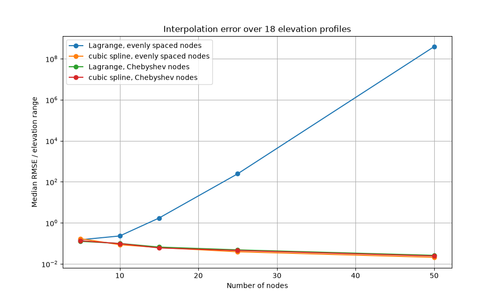
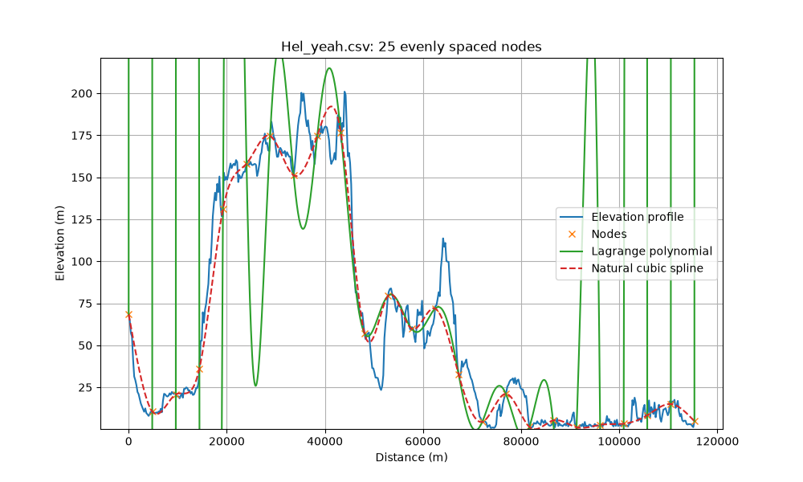
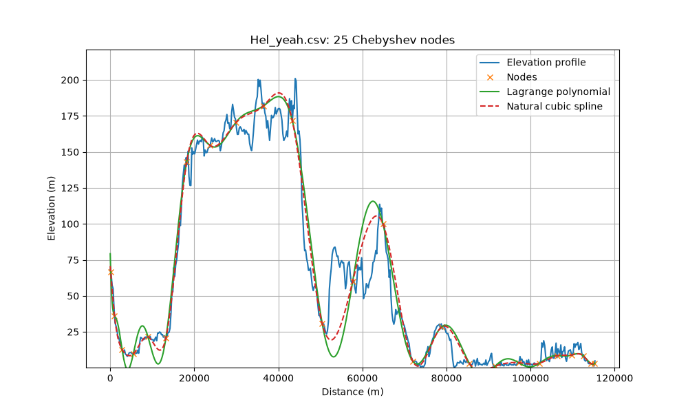

# Numerical Methods in Python

[](https://github.com/tarka1939/Repozytorium_Projektow_MN/actions/workflows/ci.yml)

Three projects from the *Metody Numeryczne* (Numerical Methods) course. Each one implements the method by hand (exponential moving averages, Jacobi, Gauss-Seidel, LU with pivoting, banded elimination, Lagrange and cubic spline interpolation), checks it against NumPy/pandas in a test file, and applies it to real data. CI runs every test file and each project end to end.

## Results

| Project | Question | Answer from the code in this repository |
|---|---|---|
| [MACD backtest](#project-1--macd-trading-backtest) | Does trading MACD crossovers beat buying and holding Microsoft stock, Jan 2021 to Mar 2025? | **No.** $10,000 becomes $11,729 with MACD and $18,189 with buy and hold. The graded version reported about $44,000 because of a look-ahead bug, described below |
| [Linear solvers](#project-2--linear-system-solvers) | Jacobi, Gauss-Seidel and LU on a pentadiagonal system: which is fastest, and when do the iterative methods fail? | Banded elimination solves N = 3000 in 0.04 s; dense LU takes 1.2 s. With a1 = 3 both iterative methods diverge, as the spectral radius predicts (1.33 and 1.93) |
| [Interpolation](#project-3--interpolation-of-elevation-profiles) | Lagrange or cubic spline, evenly spaced or Chebyshev nodes, on 18 real elevation profiles? | Lagrange on evenly spaced nodes diverges (Runge's phenomenon). Chebyshev nodes fix that. For splines, evenly spaced nodes are as good or better |

## Project 1 — MACD trading backtest

[`MN_Proj_1/MN_Proj_1`](MN_Proj_1/MN_Proj_1)

The program computes the MACD indicator (EMA12 − EMA26, signal line = EMA9 of that) from daily Microsoft prices in [`data.csv`](MN_Proj_1/MN_Proj_1/data.csv). It then simulates a simple strategy over 2021-01-04 to 2025-03-21 (1,059 trading days):

- when the MACD line crosses above the signal line, spend 80% of the cash;
- when it crosses below, sell 80% of the shares.

A crossover is only known at the close, so the order is filled at the next day's open.

| From $10,000 | Final value |
|---|---|
| MACD strategy, no fees | **$11,729** (93 transactions) |
| MACD strategy, 0.1% fee per transaction | $11,024 |
| MACD strategy, 0.25% fee per transaction | $10,044 |
| Buy and hold (all in at the first open) | **$18,189** |
| *Graded version, with the look-ahead bug* | *$44,179* |

**The look-ahead bug in the graded version.** The list of crossovers was shifted by one row against the price table. As a result, a signal known only at the close of day *t+1* was filled at the open of day *t*, so the strategy bought and sold before the information existed. The fix changed the conclusion. The PDF report ([`Document.pdf`](MN_Proj_1/MN_Proj_1/Document.pdf), in Polish) was written from the old numbers and says MACD gives "very stable growth" of capital; that no longer holds.

[`test_macd.py`](MN_Proj_1/MN_Proj_1/test_macd.py) checks that changing prices after day *k* leaves the portfolio value up to day *k* unchanged. The graded code fails this check; the current code passes it. Other changes:

- The EMA is now the exact one-pass recurrence, checked against `pandas.ewm(adjust=False)`. Before, it was a recursion cut off after 50 steps, which was off by up to 0.77 and took O(N²) time for the signal line.
- The program prints the total portfolio value; before, it printed only the cash.
- There's an optional transaction fee.
- The random zoom-in plot works; before, it raised an exception.

## Project 2 — Linear system solvers

[`MN_Proj_2/MN_Proj_2`](MN_Proj_2/MN_Proj_2)

The program solves *Ax = b* for a pentadiagonal *A*: *a1* on the diagonal and −1 on the two diagonals either side of it, with *b<sub>n</sub>* = sin(9n). All five methods are implemented by hand:

- Jacobi ([`Jacobi.py`](MN_Proj_2/MN_Proj_2/Jacobi.py))
- Gauss-Seidel ([`Gauss_Seidel.py`](MN_Proj_2/MN_Proj_2/Gauss_Seidel.py))
- dense LU with partial pivoting and blocked updates ([`LU_Factor.py`](MN_Proj_2/MN_Proj_2/LU_Factor.py))
- banded Gaussian elimination with partial pivoting ([`Band_Solver.py`](MN_Proj_2/MN_Proj_2/Band_Solver.py))
- `numpy.linalg.solve`, as the reference

Both iterative methods start from *x* = 0 and stop when ‖*Ax* − *b*‖ < 10⁻⁹.

**System A (a1 = 13) and system B (a1 = 3), N = 1279:**

| | Spectral radius of the iteration matrix | System A | System B |
|---|---|---|---|
| Jacobi | A: 0.31, B: 1.33 | 14 iterations | diverges (stopped after 113 iterations) |
| Gauss-Seidel | A: 0.14, B: 1.93 | 11 iterations | diverges (stopped after 46 iterations) |
| LU, dense or banded | — | residual 3·10⁻¹⁵ | residual 4·10⁻¹⁵ |

System B's matrix is symmetric but indefinite: its smallest eigenvalue is −1. For a symmetric matrix with a positive diagonal, Gauss-Seidel converges only if the matrix is positive definite, so its failure here is expected rather than a bug. Both iterative methods now detect divergence and stop. The graded version ran 1000 iterations until the residual overflowed.

**Time vs. number of unknowns** (system A, best of 3 runs on a 4-core cloud VM):

| N | Jacobi | Gauss-Seidel | LU (dense) | LU (banded) | `numpy.linalg.solve` |
|---|---|---|---|---|---|
| 1000 | 0.006 s | 0.03–0.05 s | 0.07–0.08 s | 0.01 s | 0.02 s |
| 2000 | 0.025 s | 0.06 s | 0.36 s | 0.024 s | 0.11–0.14 s |
| 3000 | 0.057 s | 0.13 s | 1.2 s | 0.037 s | 0.41–0.47 s |

- Banded elimination does O(N) work, so it's fastest at large N. Dense LU is O(N³).
- Gauss-Seidel needs fewer iterations than Jacobi, but each Gauss-Seidel sweep is a Python loop over the rows. Jacobi's single matrix-vector product is faster on the clock. That's a property of this implementation, not of the methods.

Changes after grading:

- Both methods now use the same stopping rule. Gauss-Seidel used to stop on the step size and return the previous iterate (true residual 2.1·10⁻⁹ against a 10⁻⁹ target).
- LU uses its own forward and back substitution. It used to call `np.linalg.solve` twice.
- The dense LU is blocked: N = 3000 now takes 1.2 s, down from 22 s.
- New: the banded solver, divergence detection, and the spectral radii.

## Project 3 — Interpolation of elevation profiles

[`MN_Proj_3`](MN_Proj_3)

The data are 18 route elevation profiles of 512 samples each: 0.6 to 328 km long, at elevations from −10.8 km (Challenger Deep) to 8.8 km (Mount Everest). From *n* nodes on each profile, the program builds:

- a Lagrange polynomial;
- a natural cubic spline.

Both are built on evenly spaced nodes and on Chebyshev nodes. Each curve is compared with the profile at all 512 samples. The error is RMSE divided by the route's elevation range, so routes of different heights can be compared.

**Median error over the 18 routes:**

| Nodes | Lagrange, evenly spaced | Lagrange, Chebyshev | Spline, evenly spaced | Spline, Chebyshev |
|---|---|---|---|---|
| 5 | 0.15 | 0.13 | 0.17 | 0.14 |
| 10 | 0.23 | 0.10 | **0.086** | 0.098 |
| 15 | 1.7 | 0.066 | 0.063 | **0.060** |
| 25 | 246 | 0.048 | **0.039** | 0.045 |
| 50 | 390,000,000 | 0.026 | **0.021** | 0.024 |

- Lagrange on evenly spaced nodes diverges as *n* grows; this is Runge's phenomenon. On Chebyshev nodes, Lagrange beats evenly spaced nodes on all 18 routes from 15 nodes up.
- Splines don't need Chebyshev nodes. From 10 nodes up, the spline on evenly spaced nodes beats the spline on Chebyshev nodes on 13 to 16 of the 18 routes.



| 25 evenly spaced nodes | 25 Chebyshev nodes |
|---|---|
|  |  |

Changes after grading:

- The plots for Chebyshev nodes used to show the spline built on the evenly spaced nodes. They now show the spline through their own nodes.
- New: the error table and its comparison across routes.
- The distance axis now says metres; it said km.
- A broken draft script was removed.

## Running

Each project has its own `requirements.txt`:

```bash
cd MN_Proj_1/MN_Proj_1 && pip install -r requirements.txt && python test_macd.py && python MN_Proj_1.py
cd MN_Proj_2/MN_Proj_2 && pip install -r requirements.txt && python test_solvers.py && python MN_Proj_2.py
cd MN_Proj_3 && pip install -r requirements.txt && python test_interpolation.py && python MN_Proj_3.py
```

`python MN_Proj_3.py --save figures` regenerates the figures above. The Visual Studio solutions (`.sln` / `.pyproj`) still work.

## Limitations

- **Project 1** uses one stock, one period and one parameter set (12/26/9). There's no out-of-sample test. A rising market favours buy and hold, and the 80% rule keeps part of the money in cash. Treat the result as one data point, not a verdict on MACD.
- **Project 2:** timings depend on the machine. The solvers take the matrix as a dense N×N array. The banded solver reads only the five diagonals, but the system generator still allocates N² entries.
- **Project 3** treats the 512-sample profile as the truth. Lagrange is evaluated with the direct formula, not the barycentric form. Chebyshev nodes don't include the end points, so both methods extrapolate slightly at the ends of the route.
